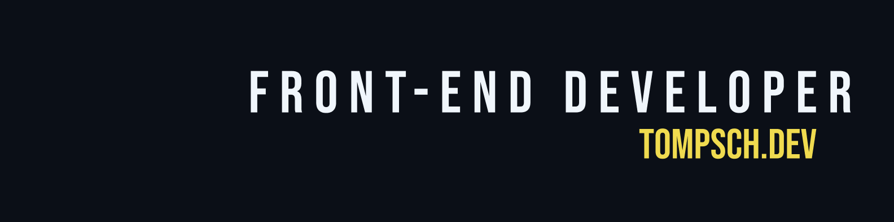

# Tomás Puebla Schildknecht – Portfolio

Welcome to the source code of my personal portfolio website.

🔗 Live Web: https://tompsch.dev

 

## About

This portfolio showcases my projects, technical skills, and professional background as a Front-End Developer. It was designed and developed from scratch with a strong focus on performance, responsive design, accessibility, and user experience.

The website features smooth 3D animations, multilingual support, dark/light theme switching, and interactive UI elements while maintaining fast loading times and clean, maintainable code.

## Features

- Responsive design for desktop, tablet, and mobile

- Interactive 3D scene built with Three.js

- Dark and light theme support

- English and Spanish language support

- Client-side form validation

- Smooth CSS animations and transitions

- Performance and accessibility focused

- Clean, component-based architecture

## Built With

### Front-End

- React

- TypeScript

- Vite

- HTML5

- CSS3 (Vanilla CSS)

### Libraries

- Three.js

- React Three Fiber

- Formik

- Yup

- React Router

- React Intersection Observer 

 

# Contact

**Portfolio**: https://tompsch.dev/contact

**LinkedIn**: https://www.linkedin.com/in/tompsch

**Email**: hello@tompsch.dev

Feel free to reach out if you'd like to collaborate or discuss web development, technology, or new opportunities.

